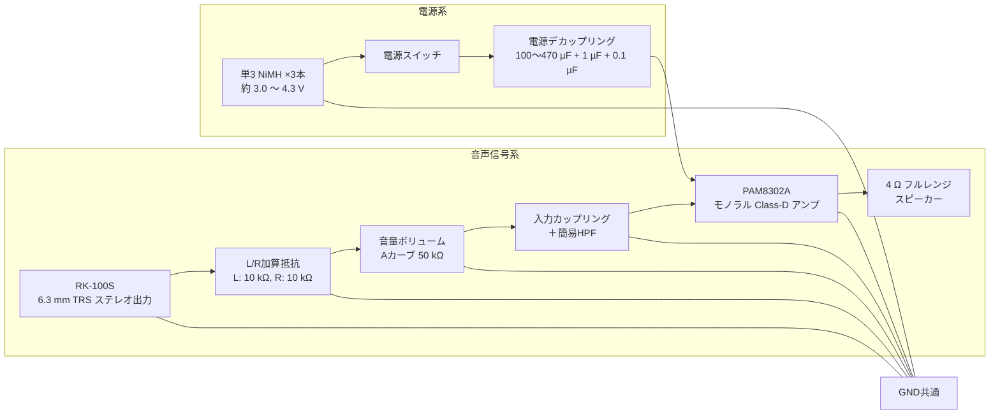

# 構想
## コンセプト
シンセサイザーRK 100S-2に使える、電池駆動のポータブルアンプスピーカーが作りたい。 
歩き回れて楽しいねがしたい。
## 簡易構成図

## 部品選定
|部品|品番、仕様|数量|備考|url|
|----|----|----|----|---|
|フォンプラグジャック|6.35 mm TRSメス|1|第2アメ横ボントンにて購入||
|抵抗||2|10 kΩ、L/R加算||
|可変抵抗|Aカーブ 50 kΩ|1|マスターボリューム 第2アメ横ボントンにて購入||
|パワーアンプ|PAM8302AADCR|1|モノラルClass-D|https://akizukidenshi.com/catalog/g/g114187/|
|抵抗||2|47 kΩ、||
|コンデンサ||2|22 nF、HPF||
|セラミックコンデンサ||1|0.1 μF、X5R 電源デカップリング||
|セラミックコンデンサ||1|1 μF、X5R 電源デカップリング||
|セラミックコンデンサ||1|10 μF、X5R 電源デカップリング||
|電解コンデンサ||1|470 μF 電源デカップリング||
|スピーカー|4 Ω、φ65.5 mm|1|第2アメ横ボントンにて購入||
|単3 NiMH||3|手持ちのeneloop利用||
|電池ホルダ|単3x3、スイッチ付き|1|第2アメ横ボントンにて購入||
|ツマミ||1|第2アメ横ボントンにて購入||

